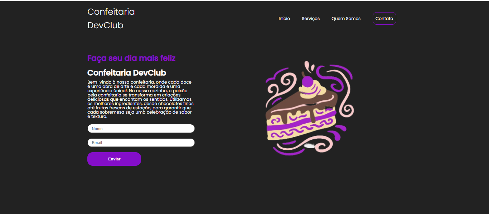

# Landing Page Confeiteria

## Sobre

* Esta aplicação simula um site de confeitaria simples, com um breve resumo da confeiteria, um campo de nome e email.

## Tecnologias Utilizadas
    
*  
* 
*  

## Contribuição

* Contribuições são bem-vindas, sinta-se à vontade para Clonar o repositório ou enviar Pull requests.

## Website 🌐 ➡️ https://danielolivermoco.github.io/Landing-Page-Confeitaria/

